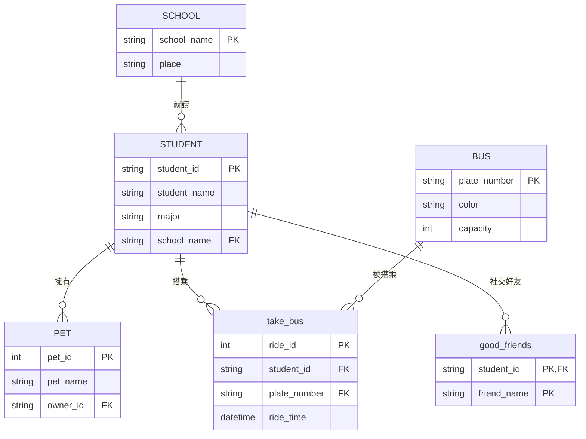

# 學生交通與社交關係資料庫系統實作

本專案實作了一個完整的關聯式資料庫，模擬大學校園內的學生生活。包含：
- **3 間學校**：台大、成大、文大。
- **5 名學生**：資工、電機、企管、中文系。
- **3 台巴士**：紅、藍、綠色巴士。
- **5 筆乘車紀錄**：確保每位學生都有搭乘資料。
- **7 隻寵物**：符合「3人各1隻，2人各2隻」的分配。
- **7 筆好友關係**：以學號連結好友「真實姓名」，並設定複合主鍵以便在 phpMyAdmin 編輯。

## 1. 實體關係圖 (ERD)

