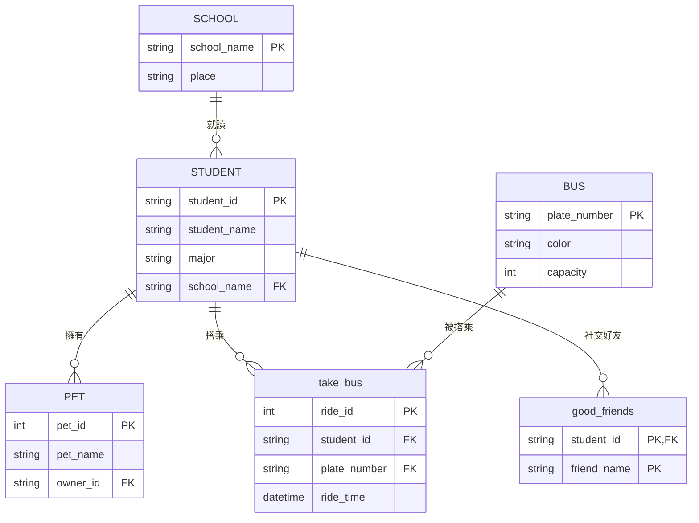

```mermaid
erDiagram
    SCHOOL ||--o{ STUDENT : "就讀"
    STUDENT ||--o{ PET : "擁有"
    STUDENT ||--o{ take_bus : "搭乘"
    BUS ||--o{ take_bus : "被搭乘"
    STUDENT ||--o{ good_friends : "社交好友"

    SCHOOL {
        string school_name PK
        string place
    }
    STUDENT {
        string student_id PK
        string student_name
        string major
        string school_name FK
    }
    BUS {
        string plate_number PK
        string color
        int capacity
    }
    take_bus {
        int ride_id PK
        string student_id FK
        string plate_number FK
        datetime ride_time
    }
    PET {
        int pet_id PK
        string pet_name
        string owner_id FK
    }
    good_friends {
        string student_id PK,FK
        string friend_name PK
    }
```
