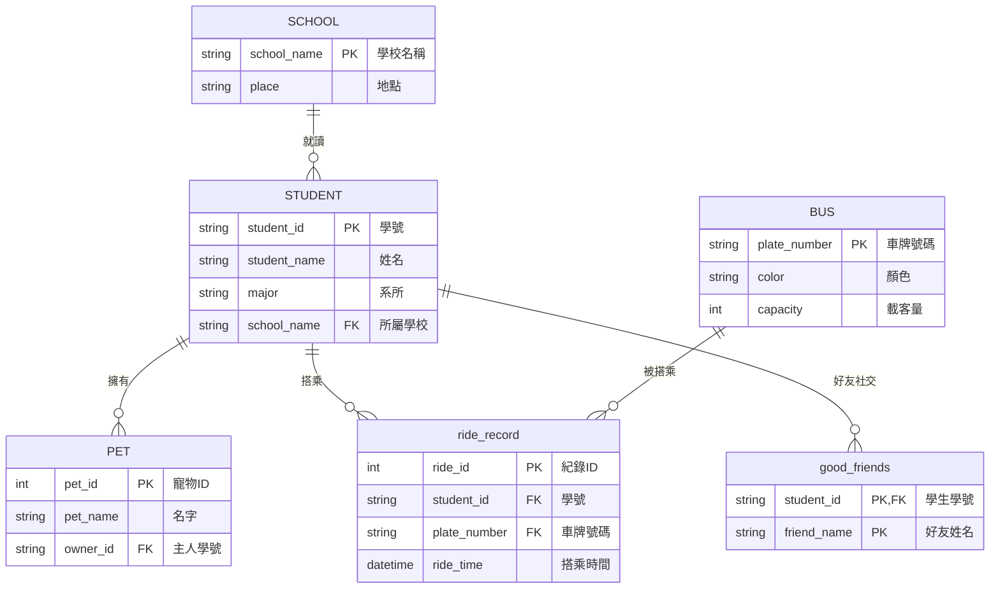

# 資料庫系統專案：學生、巴士與社交關係

本專案建立了一個完整的資料庫架構，包含學生、學校、巴士乘車記錄、寵物以及好友社交關係。

## 實體關係圖 (ERD)

# 資料庫系統專案：學生、巴士與社交關係

本專案建立了一個完整的資料庫架構，包含學生、學校、巴士乘車記錄、寵物以及好友社交關係。

## 實體關係圖 (ERD)

```# 資料庫系統專案：學生、巴士與社交關係

本專案建立了一個完整的資料庫架構，包含學生、學校、巴士乘車記錄、寵物以及好友社交關係。

## 實體關係圖 (ERD)


