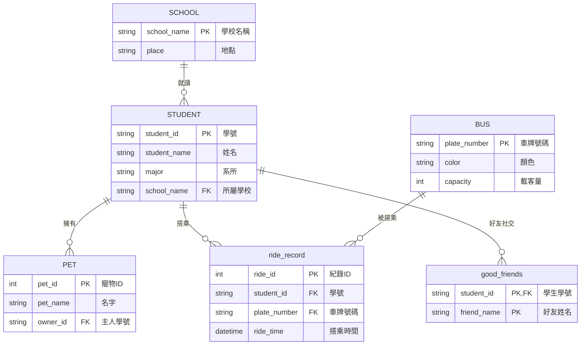

# 學生交通與社交關係管理系統 (Student Management DB)

本專案實作了一個關聯式資料庫，用於模擬大學校園內的學生生活，包含就讀學校、巴士搭乘紀錄、寵物擁有權以及學生間的好友關係。

## 1. 實體關係圖 (ERD)

使用 Mermaid 語法繪製，展示了資料表之間的關聯（包含一對多與多對多關係）。

```mermaid
erDiagram
    SCHOOL ||--o{ STUDENT : "就讀"
    STUDENT ||--o{ PET : "擁有"
    STUDENT ||--o{ ride_record : "搭乘"
    BUS ||--o{ ride_record : "被搭乘"
    STUDENT ||--o{ good_friends : "好友社交"

    SCHOOL {
        string school_name PK "學校名稱"
        string place "地點"
    }

    STUDENT {
        string student_id PK "學號"
        string student_name "姓名"
        string major "系所"
        string school_name FK "所屬學校"
    }

    BUS {
        string plate_number PK "車牌號碼"
        string color "顏色"
        int capacity "載客量"
    }

    ride_record {
        int ride_id PK "紀錄ID"
        string student_id FK "學號"
        string plate_number FK "車牌號碼"
        datetime ride_time "搭乘時間"
    }

    PET {
        int pet_id PK "寵物ID"
        string pet_name "名字"
        string owner_id FK "主人學號"
    }

    good_friends {
        string student_id PK,FK "學生學號"
        string friend_name PK "好友姓名"
    }
```
